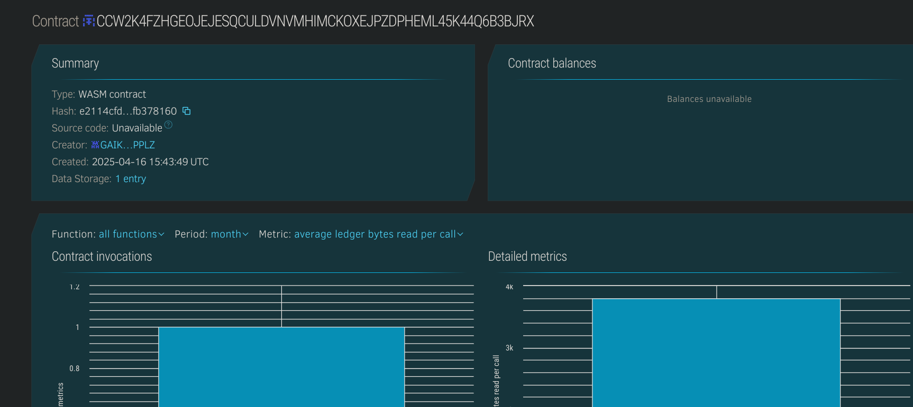

# 🎮 Quiz and Reward System

## 📝 Project Description
The Quiz and Reward System is a decentralized platform where users can participate in quizzes, answer questions, and earn rewards. The system ensures transparency and fairness in the reward distribution. Users earn rewards for correctly answering questions, and their progress is stored securely on the blockchain.

## 🌍 Project Vision
To create a fun, transparent, and decentralized way for users to participate in quizzes and be rewarded for their knowledge. This system could be expanded to integrate with educational platforms, gamified learning experiences, or incentive-based learning models.

## ✨ Key Features
- ❓ Add new questions with multiple-choice options.
- ✅ Answer questions and receive rewards for correct answers.
- 💰 Track user balances and rewards earned.
- 🔒 Secure and transparent record of all quiz activities on the blockchain.
- 📚 View all available quiz questions and answers.

## 🔮 Future Scope
- 🌍 Integration with educational platforms for gamified learning.
- 🧑‍🏫 Admin panel to manage questions and rewards.
- 🎉 Leaderboards and rankings to foster competition.
- 📱 Mobile/web interface for easy user interaction with the quiz system.

## 🛠️ Built With
- [Soroban SDK](https://soroban.stellar.org)
- Stellar Blockchain
- Rust (Smart Contract)

## Contract Details
CCW2K4FZHGEOJEJESQCULDVNVMHIMCKOXEJPZDPHEML45K44Q6B3BJRX

